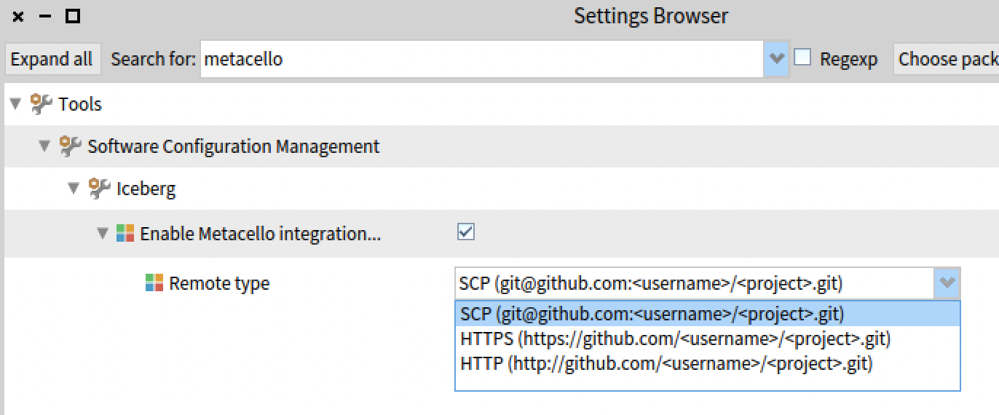

This is a template for an advanced lecture on TDD/Object-oriented design, and reverse engineering

A little testimony: 
"J'ai personnellement trouvé le cours très intéressant et rafraîchissant. C'est sûrement le cours où j'ai appris le plus de choses depuis le début de mes études supérieures.
J'ai surtout trouvé que c'était le cours avec le plus de valeur unique (des "cours" tutos pour faire des requêtes SQL ou apprendre du JS c'est bien, mais je pourrais en trouver une vingtaine en 2 clics...)"

Translated by deepl.com as 

"I personally found the course very interesting and refreshing. It's probably the course I've learned the most from since I started graduate school.
Above all, I found it to be the course with the most unique value (tutorial "courses" for making SQL queries or learning JS are fine, but I could find twenty of them in 2 clicks...).
"
_

This is the repository of the XXX  lectures done by S. Ducasse and G. Polito

contact: stephane.ducasse@inria.fr / guillermo.polito@inria.fr

Discord channel: https://discord.gg/YYY

## Modules

In this course, you will learn the following topics.

- **Module 01: Test introduction.** Unit testing. Fixtures, stimuli, assertions. Test-driven development (TDD). Extreme TDD.
- **Module 02: OOP refresh.** Classes and methods. Method lookup. Polymorphism. `self` and `super`.
- **Module 03: Reverse engineering.** Exploring an existing code base. Analyzing source code. Abstracting details. Looking for documentation outside and inside the project. Tests as documentation.
- **Module 04: Test Quality.** Mutation Analysis. Mutation Score. Equivalent mutants. Analysing surviving mutants.
- **Module 05: Hook and templates.** Hooking behavior using inheritance. Template methods. Overrides and `super` sends.
- **Module 06: Double dispatch.** Single vs. multiple dispatch. Message sends as choices. Double choices. Symmetrical and non-symmetrical double dispatch.
- **Module 07: Visitor.** Extracting operations from class hierarchies. Double dispatch as extension mechanisms. Recursion revisited.
- **Module 08: Composite.** Modelling complex tree-like structures using classes. Recursion revisited 2.
- **Module 09: Inheritance.** Subclassing vs. subtyping. Inheritance vs. composition.
- **Module 10: Types.** Dynamic vs. static message binding. Overrides vs. overwrites. The role of inheritance and interfaces in polymorphism.

## Course Material

All slides, videos, and tutorials are available in (or linked from) this repository.

- Pdfs and the videos are hosted under [https://advanced-design-mooc.pharo.org](https://advanced-design-mooc.pharo.org)
- The official website of the _'The Advanced Object-Oriented Design and Development with Pharo'_ Mooc is [https://advanced-design-mooc.pharo.org](https://advanced-design-mooc.pharo.org)
- The official website of the Pharo Mooc is [https://mooc.pharo.org](https://mooc.pharo.org)


## Course Contract

This course proposes a series of theoretical lectures and practical exercises.
Modules are divided into weeks, each in a different folder, and you will find the theory and practice in that folder.
To pass this course you will need to:
 - pass the exams (see [Calendar.md](Calendar.md))
 - make a presentation (see [Calendar.md](Calendar.md))
 - do at minimum **all** the homework in the exercises (file Exercises.md in each folder)
 - watch all the videos of the lectures not done during the lectures (yes there are videos for 99% of the support)
 - write (short) weekly reports to tell us about your activity. Remember, focus on the important things, and show us that you are learning.

### Make a group

Some of the activities during the course require group organization.
For example, this is the case for reporting and presentations.

Make your groups and create a folder inside the [Groups](Groups) directory.
Choose a name for your group and use that as a folder name.
Put it inside your group folder
 - a file with your full names and emails
 - all your activity and reports
 
make recurrent pull requests to update it.

For example, imagine that Jeanne D'arc and Tintin LeBelge are together in a group called RevolutionX.
They create a directory RevolutionX

```
Groups
    - RevolutionX
        - members.md (names and emails)
        - report-week01.md (one section for Jeanne, one for Tintin)
        - report-week02.md (one section for Jeanne, one for Tintin)
```


## FAQ

### Solving SSH problems in Git/Github

Make sure you have correctly configured you authentication setup
- If you want to use SSH authentication
    - set up your SSH keys with a recent encryption, check github's instructions
- upload your public keys to GitHub
    - If you want to use HTTPS authentication (or not do the SSH setup)
    - change Icebergs setting, "Metacello Integration" with the value HTTPS
	 
	- create an access token to be able to push (and make sure of giving it permissions by ticking the check boxes)

